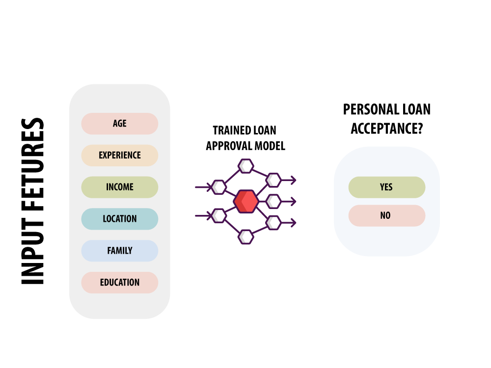

# Bank Loan Approval Using Artificial Neural Net
## Project objective:
- Understand how Artificial Intelligence and Machine Learning are applied in the banking industry.
- Understand the theory and intuition behind Deep Neural Networks.
- Import key Python libraries, dataset, and perform Exploratory Data Analysis (EDA).
- Perform data visualization using Seaborn.
- Standardize the data and split them into train and test datasets.  
- Build a deep learning model using Keras with Tensorflow 2.0 as a back-end.
- Assess the performance of the model and ensure its generalization using various KPIs.
## Project Structure
### Task 1: Understand the problem statement and business case
- In this hands-on project, we will assume that you work as a data scientist at a bank
- In this project, we aim to build and train a deep neural network model to predict the likelihood of liability customers (depositors) buying personal loans based on customer features such as age, experience, income, location, family, education, existing mortgage, credit cards, etc.
- Lenddo (https://lenddo.com) is a leading startup that uses advanced machine learning to analyze over 12,000+ features from various sources of data to predict an individual’s creditworthiness (e.x: social media count use, geolocation data, etc,)

- 

| Column Name | Column Description |
|-------------|--------------------|
| dfjaldf     | lkfjadf;sdjfla     |

### Task 2: Import Datasets and Libraries
### Task 3: Exploratory Data Analysis
### Task 4: Perform Data Visualization
### Task 5: Prepare the data to feed the model
### Task 6: Understand the theory and intuition behind Artificial Neural Networks
### Task 7: Build a simple Multi Layer Neural Network
### Task 8: Compile and train a Deep Learning Model
### Task 9: Assess the performance of the trained model

